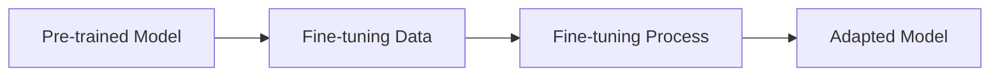

# Fine-tuning

Fine-tuning allows you to adapt pre-trained models to specific domains or tasks.

## Fine-tuning Overview

Fine-tuning is the process of taking a pre-trained model and adapting it to your specific use case:



## Quick Start

### CLI Fine-tuning

```bash
llmbuilder finetune model \
  --model ./pretrained_model/model.pt \
  --dataset domain_data.txt \
  --output ./finetuned_model \
  --epochs 5 \
  --lr 5e-5 \
  --use-lora
```

### Python API Fine-tuning

```python
import llmbuilder as lb
from llmbuilder.finetune import FineTuningConfig

# Load pre-trained model
model = lb.load_model("./pretrained_model/model.pt")

# Prepare fine-tuning dataset
from llmbuilder.data import TextDataset
dataset = TextDataset("domain_data.txt", block_size=1024)

# Configure fine-tuning
config = FineTuningConfig(
    num_epochs=5,
    learning_rate=5e-5,
    use_lora=True,
    lora_rank=16
)

# Fine-tune model
results = lb.finetune_model(model, dataset, config)
```

## Fine-tuning Methods

### 1. LoRA (Low-Rank Adaptation)

LoRA is efficient and requires less memory:

```python
from llmbuilder.finetune import LoRAConfig

lora_config = LoRAConfig(
    rank=16,                    # LoRA rank (4, 8, 16, 32)
    alpha=32,                   # LoRA alpha (usually 2x rank)
    dropout=0.1,                # LoRA dropout
)

config = FineTuningConfig(
    use_lora=True,
    lora_config=lora_config,
    learning_rate=1e-4,
    num_epochs=10
)
```

**Advantages:**
- Memory efficient (only ~1% of parameters)
- Fast training
- Easy to merge back to base model

### 2. Full Parameter Fine-tuning

Fine-tune all model parameters:

```python
config = FineTuningConfig(
    use_lora=False,             # Full fine-tuning
    learning_rate=1e-5,         # Lower LR for stability
    num_epochs=3,               # Fewer epochs needed
    weight_decay=0.01,          # Regularization
)
```

## Fine-tuning Configuration

### Basic Configuration

```python
from llmbuilder.finetune import FineTuningConfig

config = FineTuningConfig(
    # Training parameters
    num_epochs=5,               # Usually fewer than pre-training
    learning_rate=5e-5,         # Lower than pre-training
    batch_size=8,               # Often smaller due to memory

    # Fine-tuning specific
    use_lora=True,              # Use LoRA for efficiency
    freeze_embeddings=False,    # Whether to freeze embeddings

    # Regularization
    weight_decay=0.01,
    dropout_rate=0.1,
)
```

## Next Steps

- **[Generation Guide](generation.md)** - Generate text with fine-tuned models
- **[Export Guide](export.md)** - Export fine-tuned models
- **[Configuration Guide](configuration.md)** - Customize fine-tuning

<div align="center">
  <p>Start with LoRA for efficient fine-tuning with limited resources.</p>
</div>