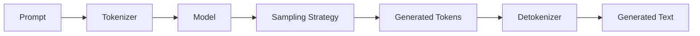

# Text Generation

Text generation is where your trained language model comes to life.

## Generation Overview

Text generation transforms your trained model into a creative writing assistant:



## Quick Start

### CLI Generation

```bash
# Interactive generation setup
llmbuilder generate text --setup

# Direct generation
llmbuilder generate text \
  --model ./model/model.pt \
  --tokenizer ./tokenizer \
  --prompt "The future of AI is" \
  --max-tokens 100 \
  --temperature 0.8

# Interactive chat mode
llmbuilder generate text \
  --model ./model/model.pt \
  --tokenizer ./tokenizer \
  --interactive
```

### Python API Generation

```python
import llmbuilder as lb

# Simple generation
text = lb.generate_text(
    model_path="./model/model.pt",
    tokenizer_path="./tokenizer",
    prompt="The future of AI is",
    max_new_tokens=100,
    temperature=0.8
)
print(text)

# Interactive generation
lb.interactive_cli(
    model_path="./model/model.pt",
    tokenizer_path="./tokenizer",
    temperature=0.8
)
```

## Generation Parameters

### Core Parameters

```python
from llmbuilder.inference import GenerationConfig

config = GenerationConfig(
    # Length control
    max_new_tokens=100,         # Maximum tokens to generate
    min_new_tokens=10,          # Minimum tokens to generate

    # Sampling parameters
    temperature=0.8,            # Creativity (0.1-2.0)
    top_k=50,                   # Top-k sampling
    top_p=0.9,                  # Nucleus sampling
    repetition_penalty=1.1,     # Prevent repetition

    # Generation strategy
    do_sample=True,             # Use sampling vs greedy
)
```

## Sampling Strategies

### 1. Greedy Decoding

Always choose the most likely token:

```python
config = GenerationConfig(
    do_sample=False,            # Disable sampling
    temperature=1.0,            # Not used in greedy
)

text = lb.generate_text(
    model_path="./model/model.pt",
    tokenizer_path="./tokenizer",
    prompt="Machine learning is",
    config=config
)
```

### 2. Temperature Sampling

Control randomness with temperature:

```python
# Conservative (more predictable)
conservative_config = GenerationConfig(
    temperature=0.3,            # Low temperature
    do_sample=True
)

# Balanced
balanced_config = GenerationConfig(
    temperature=0.8,            # Medium temperature
    do_sample=True
)

# Creative (more diverse)
creative_config = GenerationConfig(
    temperature=1.5,            # High temperature
    do_sample=True
)
```

**Temperature effects:**
- **0.1-0.3**: Very focused, predictable
- **0.5-0.8**: Balanced creativity
- **1.0-1.5**: More creative, diverse
- **1.5+**: Very creative, potentially incoherent

### 3. Top-k Sampling

Sample from top k most likely tokens:

```python
config = GenerationConfig(
    do_sample=True,
    temperature=0.8,
    top_k=40,                   # Consider top 40 tokens
)
```

## Next Steps

- **[Export Guide](export.md)** - Export your models
- **[Fine-tuning Guide](fine-tuning.md)** - Improve your models
- **[Configuration Guide](configuration.md)** - Customize generation

<div align="center">
  <p>Start with temperature 0.8 for balanced text generation.</p>
</div>