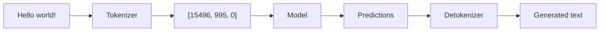

# Tokenization

Tokenization converts text into numerical tokens that language models can understand.

## Overview

Tokenization bridges the gap between human text and machine learning:



## Tokenization Algorithms

LLMBuilder supports several tokenization algorithms:

### Byte-Pair Encoding (BPE) - Recommended

BPE is the most popular algorithm for language models:

```python
from llmbuilder.tokenizer import TokenizerTrainer
from llmbuilder.config import TokenizerConfig

# Configure BPE tokenizer
config = TokenizerConfig(
    vocab_size=16000,
    model_type="bpe"
)

# Train tokenizer
trainer = TokenizerTrainer(config=config)
trainer.train(
    input_file="training_data.txt",
    output_dir="./tokenizer"
)
```

### Unigram Language Model

Statistical approach that optimizes vocabulary:

```python
config = TokenizerConfig(
    vocab_size=16000,
    model_type="unigram"
)
```

## Quick Start

### CLI Training

```bash
# Train a BPE tokenizer
llmbuilder tokenizer train \
  --input training_data.txt \
  --output ./tokenizer \
  --vocab-size 16000 \
  --algorithm bpe
```

### Python API

```python
from llmbuilder.tokenizer import train_tokenizer

# Train tokenizer with default settings
tokenizer = train_tokenizer(
    input_file="training_data.txt",
    output_dir="./tokenizer",
    vocab_size=16000
)

# Test the tokenizer
text = "Hello, world! This is a test."
tokens = tokenizer.encode(text)
decoded = tokenizer.decode(tokens)

print(f"Original: {text}")
print(f"Tokens: {tokens}")
print(f"Decoded: {decoded}")
```

## Configuration Options

### Basic Configuration

```python
from llmbuilder.config import TokenizerConfig

config = TokenizerConfig(
    # Core settings
    vocab_size=16000,           # Vocabulary size
    model_type="bpe",           # Algorithm: bpe, unigram, word, char

    # Special tokens
    unk_token="<unk>",         # Unknown token
    bos_token="<s>",           # Beginning of sequence
    eos_token="</s>",          # End of sequence
    pad_token="<pad>",         # Padding token
)
```

## Next Steps

- **[Training Guide](training.md)** - Train models with your tokenizer
- **[Generation Guide](generation.md)** - Generate text
- **[Export Guide](export.md)** - Export models

<div align="center">
  <p>Start with BPE tokenization for most use cases.</p>
</div>